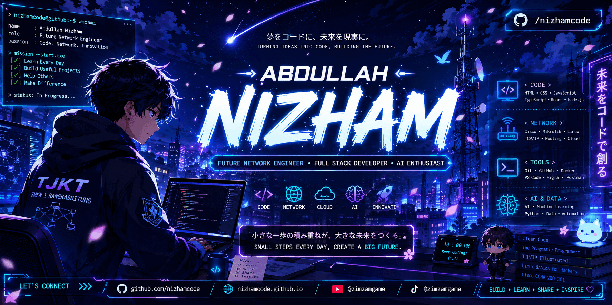

<p align="center">
  
</p>

<h1 align="center">
  Assalamu'alaikum 👋 I'm Abdullah Nizham Alfakhri
</h1>

<h3 align="center">
  🎓 TJKT Student • 🌐 Future Network Engineer • 💻 Web Developer • 🇯🇵 Road to Japan
</h3>

<p align="center">
  
</p>

<p align="center">
  <a href="https://github.com/nizhamcode">
    
  </a>
  <a href="https://github.com/nizhamcode?tab=repositories">
    
  </a>
  <a href="https://nizhamcode.github.io/portofolio-nizham/">
    
  </a>
</p>

---

## 👨‍💻 About Me

```yaml
Name        : Abdullah Nizham Alfakhri
Username    : nizhamcode
School      : SMKN 1 Rangkasbitung
Major       : Teknik Jaringan Komputer dan Telekomunikasi (TJKT)
Country     : Indonesia 🇮🇩

Focus:
  - Computer Networking
  - Web Development
  - Linux & System Administration
  - Git & GitHub
  - Programming Fundamentals

Career Goal:
  - Network Engineer
  - Full Stack Developer
  - IT Professional
  - International Career / Japan 🇯🇵
```

I am a TJKT student who is building my foundation in **computer networking, web development, Linux, programming, and open-source development**.

My philosophy is simple:

> **Learn the fundamentals → build real projects → document the process → keep improving.**

---

## 🚀 Currently Building

I'm focusing on turning what I learn into real projects and documentation.

* 🌐 Personal Portfolio & Web Projects
* 🧠 TJKT Learning Resources
* 🌍 Networking Notes & Labs
* 🐧 Linux Practice & System Administration
* ⚡ JavaScript Projects
* 📚 Programming Fundamentals
* 🔧 Git & GitHub Workflow
* 🇯🇵 Japanese Learning & Road to Japan

---

## 🛠️ Tech Stack

### 🌐 Web Development

<p>
  
</p>

**HTML5 • CSS3 • JavaScript**

### 🌍 Networking

```text
TCP/IP
IPv4
Subnetting
LAN / WAN
Network Fundamentals
Troubleshooting
Cisco Fundamentals
MikroTik Fundamentals
```

> Networking technologies are being learned progressively through TJKT study and practical exercises.

### 🐧 Systems

<p>
  
</p>

**Linux • Windows • Command Line**

### 🔧 Tools

<p>
  
</p>

**Git • GitHub • VS Code**

### 📚 Currently Learning

```text
HTML & CSS
JavaScript
Linux Fundamentals
Computer Networking
Git & GitHub
English
Japanese — JLPT N5
```

---

## ⭐ Featured Projects

My goal is not to collect repositories, but to build projects that demonstrate what I learn.

| Project              | Focus                                | Status      |
| -------------------- | ------------------------------------ | ----------- |
| 🌐 Portfolio Website | Personal portfolio & web development | 🟢 Active   |
| 🗓️ Schedule SMP 6   | HTML • CSS • JavaScript              | 🟢 Live     |
| 🧠 TJKT Quiz         | Learning & assessment project        | 🟢 Active   |
| 💻 HTML & CSS Notes  | Web development fundamentals         | 🟡 Learning |
| 🌍 Networking Notes  | Computer networking journey          | 🟡 Learning |
| 🇯🇵 Road to Japan   | Japanese & career preparation        | 🟡 Learning |

### 🎯 Project Philosophy

Every project should answer at least one question:

```text
What did I learn?
What problem does it solve?
What technology did I use?
What can I improve next?
```

---

## 🏆 Achievements

* 🥇 Overall Rank 1 — Grade 7–9
* 🧮 Mathematics Olympiad / OSN School Selection
* 👨‍🏫 Class Leader
* 🎓 Accepted to SMKN 1 Rangkasbitung — TJKT
* 💻 Building a public GitHub portfolio
* 🌐 Publishing learning projects with GitHub Pages

---

## 📊 GitHub Statistics

<p align="center">
  
  
</p>

<p align="center">
  
</p>

---

## 🎯 2026 Goals

* [x] Enter TJKT at SMKN 1 Rangkasbitung
* [x] Build and publish GitHub projects
* [x] Create a personal developer profile
* [ ] Build 20+ meaningful projects
* [ ] Strengthen HTML & CSS fundamentals
* [ ] Learn JavaScript systematically
* [ ] Master Linux fundamentals
* [ ] Master computer networking fundamentals
* [ ] Build networking labs
* [ ] Earn a first technology certification
* [ ] Improve English
* [ ] Start structured Japanese JLPT N5 preparation

---

## 🛣️ Developer & Network Engineer Roadmap

```text
                    NIZHAMCODE ROADMAP
                           │
                           ▼
                   ┌───────────────┐
                   │  FUNDAMENTALS │
                   └───────┬───────┘
                           │
             ┌─────────────┼─────────────┐
             ▼             ▼             ▼
          Web Dev      Networking      Linux
             │             │             │
             └─────────────┼─────────────┘
                           ▼
                    Programming
                           │
                           ▼
                  Practical Projects
                           │
                           ▼
                  GitHub & Open Source
                           │
                           ▼
                ┌────────────────────┐
                │ Network Engineering│
                └─────────┬──────────┘
                          │
              ┌───────────┼───────────┐
              ▼           ▼           ▼
            Cisco      MikroTik     Python
              │           │           │
              └───────────┼───────────┘
                          ▼
                    Network Labs
                          │
                          ▼
                     Internship
                          │
                          ▼
                  Certification
                          │
                          ▼
                 Career / Study 🇯🇵
```

---

## 📅 Long-Term Roadmap

| Year      | Main Focus                                        |
| --------- | ------------------------------------------------- |
| **2026**  | TJKT • Computer Fundamentals • Git & GitHub       |
| **2027**  | HTML • CSS • JavaScript • Linux • Networking      |
| **2028**  | Cisco • MikroTik • Python • Network Labs          |
| **2029**  | Internship • Certification • Portfolio • Japanese |
| **2030+** | Network Engineer / IT Career / Japan 🇯🇵         |

---

## 🇯🇵 Road to Japan

Japan is a long-term goal, but the preparation starts with fundamentals.

```text
TECHNICAL SKILLS
      │
      ├── Networking
      ├── Linux
      ├── Programming
      ├── Web Development
      └── Git / GitHub
            │
            ▼
       PORTFOLIO
            │
            ▼
     CERTIFICATIONS
            │
            ▼
        ENGLISH
            │
            ▼
      JAPANESE LANGUAGE
            │
            ▼
        JLPT N5 → N4 → N3
            │
            ▼
     INTERNSHIP / EXPERIENCE
            │
            ▼
       INTERNATIONAL
          CAREER 🇯🇵
```

---

## 📚 Learning Principles

I believe good developers are built through consistency.

```text
01. Understand the fundamentals.
02. Practice instead of only watching tutorials.
03. Build real projects.
04. Document what you learn.
05. Read documentation.
06. Use Git properly.
07. Learn from mistakes.
08. Share useful knowledge.
09. Improve one step at a time.
10. Stay curious.
```

---

## 📈 What I Want to Improve

```text
Current
  ↓
Computer Fundamentals
  ↓
Web Development
  ↓
Networking
  ↓
Linux
  ↓
Programming
  ↓
Automation
  ↓
Cloud & Infrastructure
  ↓
Network Engineering
```

The goal is not to learn everything at once.

The goal is to build a **strong technical foundation**.

---

## 🌱 Open Source Journey

My GitHub is also my public learning journal.

I want to gradually learn how to:

* Create useful repositories
* Write better documentation
* Use branches properly
* Create meaningful commits
* Open and review pull requests
* Contribute to open-source projects
* Collaborate with other developers
* Build projects that help other students

---

## 🇯🇵 自己紹介

こんにちは！

アブドゥラ・ニザム・アルファクリです。

* 🎓 インドネシアのTJKT学生です
* 🌐 ネットワークエンジニアを目指しています
* 💻 Web開発を勉強しています
* 🐧 Linuxとコンピュータネットワークを勉強しています
* 🇯🇵 日本語を勉強しています
* 🚀 将来、日本でIT分野のキャリアを築くことが目標です

**一歩ずつ、頑張ります！**

---

## 📫 Connect With Me

<p align="center">
  <a href="https://github.com/nizhamcode">
    
  </a>
  <a href="https://nizhamcode.github.io/portofolio-nizham/">
    
  </a>
</p>

---

## 💡 My Philosophy

> **Learn consistently.**
> **Build real projects.**
> **Document the journey.**
> **Share knowledge.**
> **Never stop growing.**

---

## 🎯 My Mission

```text
Build Skills        📚
      ↓
Build Projects      💻
      ↓
Build Experience    🧠
      ↓
Build Character     🤝
      ↓
Build Opportunities 🚀
      ↓
Build the Future    🌏
      ↓
Road to Japan       🇯🇵
```

---

<p align="center">

### ⭐ Thanks for visiting my GitHub Profile!

**Learn • Build • Share • Grow**

🚀 **NizhamCode**

</p>
